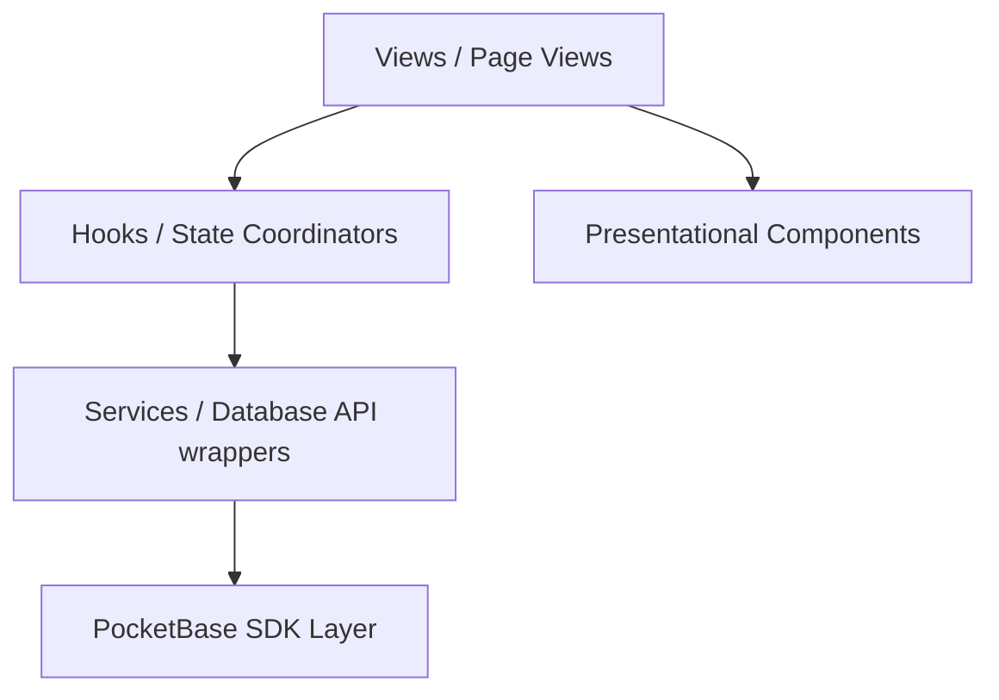

# Choir Management Tool - Comprehensive Code Review & Architectural Audit

This document presents a comprehensive review of the codebase, evaluating the system's structural patterns, UI aesthetics, database resiliency, and specific feature implementations (such as seating and attendance).

---

## 1. Architectural Architecture & Layer Separation

The codebase exhibits a mature, structured implementation of a decoupled frontend architecture. It strictly adheres to the core layer boundaries specified in `GEMINI.md`:



### A. Pure PocketBase Services (`src/services/`)
- **Structure:** Encapsulates exact direct API calls using the initialized PocketBase instance (`pb`). E.g. [profileService.ts](file:///Users/wesosborn/Downloads/choir-management-tool/src/services/profileService.ts), [rosterService.ts](file:///Users/wesosborn/Downloads/choir-management-tool/src/services/rosterService.ts).
- **Type Safety:** High type safety with explicitly typed collection requests (`getFirstListItem<T>`, `getFullList<T>`) using TypeScript interfaces (such as `Profile`, `AuditionSettings`, `SeatingChart`).
- **Transactional Integrity:** Excellent cleanup handlers. For example, during profile creation, if the profile entry fails after the user account was successfully created, it performs an immediate deletion of the orphan user record:
  ```typescript
  try {
    return await pb.collection('profiles').create<Profile>({ ...profile, user: user.id });
  } catch (err) {
    await pb.collection('users').delete(user.id).catch(() => undefined);
    throw err;
  }
  ```

### B. Coordinated Hooks (`src/hooks/`)
- **Structure:** Coordinates server fetches, optimistic local state updates, error checking, and loading flags.
- **Resiliency:** Standardizes parallel request operations securely. For example, the `setAllAttendance` function in [useAttendance.ts](file:///Users/wesosborn/Downloads/choir-management-tool/src/hooks/useAttendance.ts) handles parallel upserts using `Promise.all` with a full rollback fallback:
  ```typescript
  const originalItems = [...items];
  // ... local optimistic set ...
  try {
    await Promise.all(subset.map(item => rosterService.upsertAttendance(eventId, item.profileId, next)));
  } catch (err) {
    setItems(originalItems); // Rollback
    throw err;
  }
  ```

### C. Presentational Components (`src/components/`)
- **Structure:** Pure, modular components (`CheckInList`, `SeatingGrid`, `RosterTable`) displaying props and passing events upwards.
- **Hygiene:** Keeps business logic externalized, keeping components reusable and simple.

---

## 2. PocketBase Integration & Data Resilience

### A. Session and Token Resilience
The core PocketBase initialization file [pocketbase.ts](file:///Users/wesosborn/Downloads/choir-management-tool/src/lib/pocketbase.ts) successfully implements the stale token resilience filter:
- Employs an `afterSend` interceptor that automatically wipes out `pb.authStore` and redirects the browser back to `/login` if a `401 Unauthorized` or `403 Forbidden` response is detected. This perfectly satisfies security requirements and avoids token loops.

### B. Form Validation & Error Handling
We reviewed the newly added `formatPocketBaseError` in [pocketbase.ts](file:///Users/wesosborn/Downloads/choir-management-tool/src/lib/pocketbase.ts):
- Translates PocketBase nested field validations into human-friendly messages.
- Convers camelCase properties (`voicePart`) to clean space-capitalized strings (`Voice Part`).
- Gracefully handles duplicate checks (`email already in use`) and range failures (`Password must be between 8 and 72 characters`).

---

## 3. Specific Feature Audits

### A. Seating Chart Creator & Drag-and-Drop Editor
Renders in [SeatingView.tsx](file:///Users/wesosborn/Downloads/choir-management-tool/src/views/admin/SeatingView.tsx):
- **Drag and Drop:** Uses raw HTML5 drag-and-drop properties. Draggable elements store singer IDs as plain text and assign seats dynamically on drops.
- **Print Modes:** Incorporates two separate styles (`visual` grid vs. structured `text` list). This allows users to export full grids or a highly readable list layout.
- **Custom Formations:** Supports presets (SATB, SBTA) as well as comma-separated custom patterns (e.g., `S,B,T,A`), dynamically clearing and shifting rosters seamlessly.
- **Auto-Save Feedback:** Features full background automatic saving indicators (`Saving...`, `✓ Saved`, `Retry Save`) matching asynchronous DB mutations.

### B. Attendance Check-In & Separators
Renders in [CheckInList.tsx](file:///Users/wesosborn/Downloads/choir-management-tool/src/components/admin/CheckInList.tsx):
- **Performance Optimized Rendering:** Extracted a separate `CheckInRow` sub-component to eliminate typing lag during folder modifications.
- **Section Dividers:** Beautifully groups unchecked and checked-in singers.
- **Custom Sorting & Voice Part Dividers:** Dynamically sorts singers by alphabetical last names or grouped voice parts (S1, S2, etc.). Features clean horizontal separator rules between distinct voice parts.

---

## 4. UI Aesthetics & Styling System

The application boasts a premium, high-fidelity aesthetic:
- **Consistent Tokens:** Leverages modular global variables (`var(--primary)`, `var(--primary-light)`, `var(--border)`, `var(--radius-md)`) configured in `index.css`.
- **Soft Accent Colors:** Prefers soft mint green tints (`rgba(74, 117, 89, 0.06)`) and light red tints (`rgba(153, 27, 27, 0.04)`) for present/absent backgrounds rather than generic bright colors. This guarantees maximum scannability and eye comfort.
- **Glassmorphism badges:** Renders rounded pills with thin, subtle borders and drop-shadow styling (such as the custom checked-in badge).
- **Responsive Layouts:** Employs flex-rows, grids, and responsive wrapping (`flex-wrap: wrap`, `flex: 1 1 200px`) ensuring seamless support from small mobile viewports to huge desktop displays.

---

## 5. Architectural Recommendations

While the codebase is exceptionally high-quality, we recommend the following optional improvements:

1. **Service Mocking / Isolation for Testing:**
   In service files like `settingsService.ts`, introduce environment-based mock service layers so that local component development and testing can be conducted without running the full local PocketBase server.
2. **Contextual Debouncing:**
   In input-based forms, incorporate a basic `useDebounce` hook rather than relying strictly on `onBlur` for auto-saves, which will reduce network chatty transactions when admins edit notes or titles.
