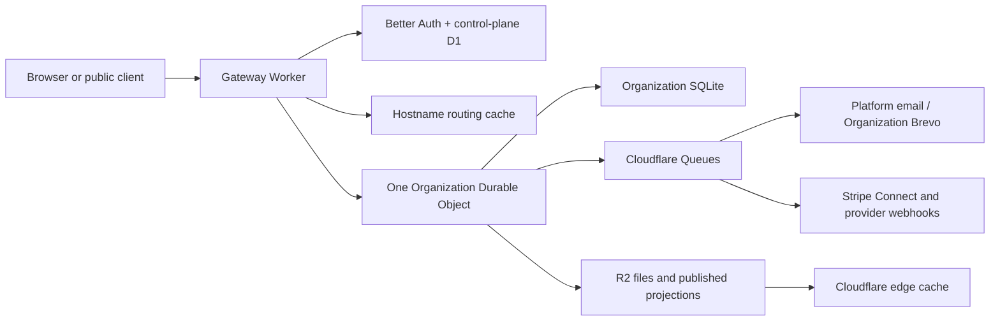

# Cloudflare Multitenant Rebuild Plan

**Status:** Approved architecture; ready to seed the new repository  
**Parity baseline:** `choir-management-tool` commit `6874d43a3c3698ae53218a44d17649bc454ca9ac`  
**Target repository:** `choir-management-cloudflare`  
**Production rule:** Internal milestones may be deployed to staging, but production does not launch until the complete parity matrix passes.

## Objective

Rebuild the application as a greenfield, multi-Organization Cloudflare application. Preserve the current product's complete behavior, visual character, accessibility, responsive behavior, exports, public experiences, and operational automation without preserving PocketBase implementation details, frontend source, or existing data.

The result is a free platform with invitation-only access, one Organization at a time, strong tenant isolation, delegated Platform Administration, customer-owned payment and communications accounts, canonical Organization subdomains, optional custom public domains including supported apex configurations, and a portable export.

## Source of Truth

Use evidence in this order:

1. Executable code and tests at the Parity Baseline establish implemented behavior.
2. Non-PocketBase rules in `AGENTS.md` remain normative, especially domain terminology, accessibility, semantic theming, network bounds, TypeScript safety, and algorithmic complexity.
3. `CONTEXT.md` and accepted ADRs define the new product language and architecture.
4. Existing plans and designs provide intent and acceptance detail, but a proposed or superseded document does not prove that a feature belongs to parity.

The legacy repository is read-only after the baseline is pinned. The new repository may inspect it locally through the Parity Bridge, but builds, tests, CI, staging, production, and runtime must stand alone.

## File Responsibility Map

The initial repository scaffold owns these exact files. Each feature milestone must add its exact new files to this map before implementation and must verify every listed file before declaring the milestone complete.

| Path | Responsibility |
| --- | --- |
| `AGENTS.md` | Cloudflare-specific engineering rules plus carried-forward domain and frontend rules |
| `CONTEXT.md` | Copied and maintained ubiquitous language |
| `README.md` | Local setup, environments, repository relationship, and common commands |
| `package.json` | npm workspace scripts and shared quality gates |
| `package-lock.json` | Single reproducible dependency graph promoted unchanged |
| `tsconfig.base.json` | Strict shared TypeScript configuration |
| `eslint.config.js` | Type, React, Workers, and complexity safety rules |
| `prettier.config.mjs` | Repository formatting policy |
| `.dev.vars.example` | Non-secret local configuration contract |
| `.github/workflows/ci.yml` | Static checks, unit/integration tests, parity validation, and build |
| `.github/workflows/deploy-staging.yml` | Automatic `main` deployment to permanent staging |
| `.github/workflows/deploy-production.yml` | Approved same-commit promotion and smoke/rollback checks |
| `apps/web/package.json` | React application package |
| `apps/web/index.html` | Vite application entry document |
| `apps/web/vite.config.ts` | Frontend build and test configuration |
| `apps/web/src/main.tsx` | Browser bootstrap |
| `apps/web/src/App.tsx` | Route composition and top-level providers |
| `apps/web/src/styles/theme.css` | Semantic design tokens and light/dark themes |
| `apps/worker/package.json` | Worker application package |
| `apps/worker/wrangler.jsonc` | Local bindings and named staging/production environments |
| `apps/worker/src/index.ts` | Worker fetch, queue, scheduled, and workflow entry points |
| `apps/worker/src/router.ts` | Typed HTTP route composition |
| `apps/worker/src/env.ts` | Binding and secret types; startup validation |
| `apps/worker/src/organization/OrganizationStore.ts` | Per-Organization SQLite Durable Object boundary |
| `apps/worker/src/organization/schema.ts` | Operational schema and schema-version registry |
| `apps/worker/src/organization/migrations.ts` | Ordered, forward-compatible Organization migrations |
| `apps/worker/src/control/schema.ts` | Control-plane D1 schema definitions |
| `apps/worker/src/control/migrations/0001_initial.sql` | Initial control-plane schema |
| `apps/worker/src/auth/config.ts` | Better Auth configuration and adapters |
| `apps/worker/src/tenancy/resolveOrganization.ts` | Hostname-to-Organization resolution |
| `apps/worker/src/tenancy/authorizeOrganization.ts` | Membership and Platform Administrator authorization |
| `apps/worker/src/jobs/consumer.ts` | Queue dispatch, retries, and dead-letter behavior |
| `apps/worker/src/jobs/contracts.ts` | Versioned, Organization-scoped job payloads |
| `apps/worker/src/publication/publishOrganization.ts` | Public projection generation and cache versioning |
| `packages/contracts/package.json` | Shared API contract package |
| `packages/contracts/src/index.ts` | Public exports for schemas and DTOs |
| `packages/domain/package.json` | Pure domain rules and calculations |
| `packages/domain/src/index.ts` | Public domain exports |
| `packages/ui/package.json` | Repository-owned Radix-based UI package |
| `packages/ui/src/index.ts` | Stable component exports |
| `packages/testkit/package.json` | Factories, fixtures, and environment harnesses |
| `packages/testkit/src/index.ts` | Shared test utilities |
| `docs/parity/feature-matrix.yaml` | Route, workflow, background-task, export, and visual parity ledger |
| `docs/parity/csv-contracts/README.md` | Versioned CSV behavior and fixture index |
| `docs/parity/signed-link-behavior.md` | Purpose, authorization, expiry, and revocation contracts |
| `docs/architecture/runtime.md` | Runtime boundaries and request flows |
| `docs/architecture/data-model.md` | Control-plane and Organization schemas |
| `docs/architecture/environments.md` | Local, preview, staging, and production resources |
| `docs/runbooks/rollback.md` | Worker rollback and forward-compatible data response |
| `docs/runbooks/provider-failure.md` | Email, SMS, Stripe, queue, and webhook incident handling |

## Target Architecture

Use one TypeScript repository with npm workspaces. React and static assets build separately but deploy with the API Worker as one versioned artifact. Hono provides a small typed Worker router; Zod schemas in `packages/contracts` validate every untrusted boundary. Business rules live in `packages/domain`, not in route handlers or React components.

### Control plane: D1

D1 contains only data that must be global or used to enter one Organization scope:

- Better Auth users, sessions, accounts, verifications, password credentials, one-time-code state, two-factor state, organizations, members, and invitations.
- Organization registry: stable ID, name, slug, lifecycle state, setup/launch state, Durable Object key, current operational schema version, health summary, and next maintenance status.
- Canonical and custom hostname registry, validation state, certificate state, redirect behavior, and routing-cache version.
- Platform Administrator grants and revocations, scoped edit elevations, recovery-code status, and platform audit events.
- Stripe connected-account mapping and Organization communications-connection metadata.
- Encrypted provider credential envelopes where dynamic Organization credentials are unavoidable. Ciphertext, nonce, key version, and fingerprint are stored; the encryption key is a Worker secret and plaintext never enters logs or audit payloads.

No roster, event, message, donation, ticket, or other operational row belongs in D1. Platform-wide screens may query Organization metadata and health only.

### Organization plane: one SQLite Durable Object per Organization

The object ID is derived exclusively from the resolved Organization registry ID. A client-supplied Organization ID never selects storage. The gateway verifies the canonical/custom host, active session, membership, module state, and optional Platform Administrator edit elevation before calling the object.

The Organization schema includes:

- configuration, module state, setup readiness, public-site content, theme, terminology, notification preferences, and voice-part/section/formation definitions;
- profiles and optional global-user links, seasons, seasonal dues, and directory preferences;
- venues, events, rehearsal/performance relationships, event rosters, RSVPs, RSVP notes, attendance, cloning state, and calendar-feed revocation state;
- music pieces, multi-work relationships, genres, reference-track metadata, set-list items, approval state, featured numbers, and ordered performer-credit snapshots;
- seating charts, chart order, formations, seats, assignments, and finder data;
- singer resources and file metadata;
- auditions and normalized requested/scheduled slots;
- polls and responses;
- message drafts, templates, recipient snapshots, communication history, delivery attempts, suppression state, and retry state for Email, SMS, and Both;
- ticket bundles, purchases, fulfillment, signed scan state, reminder state, will-call data, and checkout-expiration state;
- donations, patrons, marketing consent, tribute data, and payment state;
- Organization audit events, scheduler state, idempotency keys, public-projection versions, export jobs, and schema metadata.

Transactions that enforce capacity, payment transitions, ticket scanning, RSVP changes, poll responses, and scheduling execute inside the owning object. Repository methods return typed domain results; they do not expose arbitrary SQL over HTTP.

### R2, routing cache, and public projections

Original uploads use keys under `organizations/{organizationId}/{category}/{objectId}/{fileId}`. Metadata and authorization stay in the Organization store. Private downloads pass through an authorized Worker response; public media uses immutable versioned URLs.

A small KV namespace may cache derived `hostname -> organizationId` routing entries. D1 remains authoritative. KV is never used for permissions or operational records.

Public routes read versioned Published Projections from R2 and the edge cache. A successful Organization mutation that affects public content schedules a projection refresh; the previous projection remains valid until the new object and version pointer are complete. This protects a single Organization Durable Object from public traffic bursts without creating an editable second database.

### Background work

Each Organization Scheduler sets one Durable Object alarm for its earliest due task. The alarm transaction finds due work, writes stable job/idempotency records, enqueues jobs, and advances the next alarm. It covers the parity behaviors for:

- manual and automated email/SMS queue delivery;
- event reminders using the correct performance roster for linked rehearsals;
- ticket-buyer reminders;
- post-event attendance finalization and attendance reports;
- stale pending ticket/donation checkout expiration;
- scheduled poll archival and other time-based parity behavior discovered in the matrix.

Queue consumers perform provider calls with bounded concurrency, exponential backoff, jitter, delivery-state recording, and a dead-letter queue. Delivery is at-least-once; the Organization store prevents duplicate external effects with idempotency keys. Cloudflare Workflows handle long, resumable processes: Organization provisioning, custom-domain onboarding, fleet schema preparation, and Organization Export generation.

### Authentication and authorization

Use Better Auth on the control-plane D1 with Organization, email one-time-code, password, and two-factor capabilities:

- There is no public registration.
- Email one-time code is the primary sign-in method.
- An invited user may set and use a conventional password; administrators never assign it.
- A Profile may exist without a login. Granting portal access creates or links a pending membership and sends an invitation.
- One identity may have different roles and Profile links in multiple Organizations.
- Organization Owner, Organization Administrator, and Organization Member are authorization roles. Voice part, performer eligibility, section leadership, and notification responsibilities remain Profile attributes.
- Every Platform Administrator must enroll MFA and retain recovery codes. Organization roles may opt in.
- A Platform Administrator first enters one visible Organization scope. Read access is immediate; enabling edit creates a short-lived scoped elevation displayed in the shell. Actions record the actual actor, scope, source, and before/after summary in Organization Audit History. There is no impersonation.
- Custom public domains redirect login and account-management paths to the Organization's canonical product subdomain.

### Hostnames and public domains

Every Organization receives `{slug}.{product-domain}` for its full authenticated and public experience. Cloudflare for SaaS custom hostnames provide optional customer-owned public domains. Host resolution occurs before route authorization.

Custom domains serve only public website, performance, ticket, donation, audition, RSVP, poll, player, and other signed public flows. Admin, member, auth-management, and Platform Administrator routes are canonical-subdomain only.

For apex domains, support DNS providers that can target the SaaS hostname through CNAME flattening or ALIAS/ANAME behavior. Offer `www` as the documented fallback when a provider cannot do so. Do not make v1 depend on universal Apex Proxying.

### Payments and communications

Stripe Connect uses Organization-owned connected accounts and direct charges. The Organization is merchant of record and owns fees, refunds, disputes, taxes, and negative balances. The platform is free, takes no application fee, and has no subscription, plan, trial, entitlement, invoicing, or dunning system. Platform Administrators may initiate an Organization refund, with audit attribution.

Cloudflare Email Service sends platform transactional messages only: login codes, invitations, security notices, and domain/integration notices. Organization campaigns, reminders, reports, ticket communications, and SMS use the Organization Communications Provider. Implement a provider-neutral adapter with Brevo first, including Email, SMS, Both, reach preview, SMS length behavior, templates, drafts, history, summaries, retries, suppressions, and test sends. Organization credentials and verified identities remain Organization-owned.

Stripe and provider webhooks verify signatures before lookup. The connected account or provider connection resolves exactly one Organization in D1, and a stable webhook-event ID is applied idempotently inside that Organization store.

### API and frontend

Expose four explicit route groups:

- `/api/auth/*` for Better Auth;
- `/api/platform/*` for Platform Administrator metadata and scoped operations;
- `/api/organization/*` for authenticated, host-scoped operational APIs;
- `/api/public/*` and public page routes for published or signed interactions;
- `/api/webhooks/*` for signature-verified providers.

Use same-origin secure cookies, CSRF protection on mutations, strict allowed-host validation, content-security policy, request IDs, structured error codes, and rate limits. Protect abuse-prone OTP, audition, poll, RSVP, and public contact-style submissions with Turnstile where it does not block accessibility; payment endpoints also enforce server-side price/capacity calculations.

Keep React 19, TypeScript, Vite, Tailwind, TanStack Query, TanStack Table, and dnd-kit. Replace Shoelace/Web Awesome with repository-owned shadcn-style components built on Radix primitives. Preserve semantic theme tokens, recognizable visual character, responsive table/card behavior, safe destructive confirmations, focus management, keyboard use, mobile layouts, and meaningful loading/error/empty states. React code consumes shared contracts through a single API client; it never knows D1, Durable Object, R2, or provider schemas.

## Complete Parity Scope

The feature matrix must cover every route and workflow in the baseline, including these connected product areas:

| Area | Required behavior |
| --- | --- |
| Organization setup | Manual provisioning, resumable setup, modules, readiness, launch, settings, terminology, theme, integrations |
| Identity and people | Invitations, profile-without-login, owners/admins/members, roster CRUD/import/export, photos, directory, self-profile, preferences, On Break display |
| Events | Performances/rehearsals, venues, cloning, parent performance behavior, calendar views/feeds, archives, graphics, public details |
| RSVP and attendance | Personalized links, free public RSVP, notes, balances, decline notices, roster administration, check-in, finalization, CSV/reporting |
| Music and set lists | Catalog, multi-work pieces, genres, arranger/composer, duration, recency, reference audio, set lists, approval, featured numbers, performer snapshots, player/offline behavior |
| Seating | Multiple charts, formations, row/column strategies, automatic placement, unassigned dock, mismatches, finder, mirrored grid, neighbor HUD |
| Communications | Email/SMS/Both, recipients and filters, reach preview, drafts, templates, Markdown rendering, placeholders, history, delivery summaries, failures/retries, test sends, unsubscribe |
| Polls | Compose-time creation, personalized responses, response changes, dashboard, event grouping, archival |
| Auditions | Public inquiry, requested slots, scheduling, status workflow, confirmation communications, settings |
| Resources | Admin ordering and uploads/links, member access |
| Reports | Attendance and concert summaries, repertoire history, automated post-event reports, existing CSV formats |
| Public website | Hero/logo/media, About and History Markdown, featured/past performances, module-aware navigation, public domain behavior |
| Tickets | Event and bundle sales, capacity, price timing, checkout, success, ticket tokens/QR, scan idempotency, will-call, reminders, expiration |
| Donations and patrons | Checkout, tribute/anonymous/consent fields, success, patron aggregation/linking, history, exports |
| Seasons and dues | Seasons, due amounts/payment status, connected-account checkout, member/admin views, notifications |
| Platform operations | Organization registry/health, delegated scoped administration, audit visibility, domains, provider status, export, rollback/incident visibility |

Personalized link payload bytes do not need PocketBase compatibility because there is no data migration or outstanding-link migration. Their behavior does: every new token is versioned and contains Organization, purpose, subject/resource, expiry where appropriate, and revocation material; validation uses constant-time signature checks and rejects host/Organization mismatches. Calendar feeds remain explicitly revocable.

## Organization Export

An Owner or Platform Administrator starts a resumable Workflow. The export takes a consistent logical snapshot, paginates every Organization table, copies original R2 objects, and writes a ZIP containing:

- `manifest.json` with organization ID/name, generated time, application version, schema version, counts, checksums, and format versions;
- existing CSV contracts for roster, music library, event RSVP roster, donations, attendance, repertoire history, and will-call;
- JSON for settings, audit history, nested records, and fields that CSV cannot preserve;
- original uploads in a stable file tree plus a file index.

The completed archive is private and downloaded through a short-lived authorized URL. Test fixtures compare CSV headers, quoting, enums, dates, and the stored `Idle` value against baseline exports. There is no archive import, restoration, Organization deletion, recovery window, or purge automation in v1.

## Implementation Milestones

These are engineering milestones, not production releases.

### 0. Freeze and capture parity

- Tag or otherwise protect the baseline commit and record its commit hash in both repositories.
- Create `docs/parity/feature-matrix.yaml` with one entry for every baseline route, service workflow, public endpoint, background task, CSV export, file behavior, and major responsive state.
- Capture representative desktop/mobile screenshots and deterministic fixtures. Copy only approved contracts, fixtures, screenshots, glossary entries, ADRs, and non-PocketBase rules.
- Mark each historical plan implemented, partially implemented, proposed, superseded, or irrelevant by comparing it with code/tests.

**Gate:** Every baseline route and module has an owner and a parity entry; the new CI can run with the legacy repository absent.

### 1. Repository and Cloudflare foundation

- Create npm workspaces, strict TypeScript, formatting/lint rules, Worker/Vite builds, Miniflare/Vitest integration tests, and Playwright browser tests.
- Define separate local, preview, staging, and production bindings. Preview has isolated disposable data and cannot send real messages or create real charges.
- Deploy a health endpoint and static shell to permanent staging; add JSON logs, request IDs, error reporting, and binding validation.
- Establish shared contracts, domain-result/error conventions, test factories, and dependency boundaries.

**Gate:** One commit builds once, deploys to staging automatically, and can be promoted unchanged to an inert production smoke environment.

### 2. Identity, control plane, and tenancy proof

- Implement Better Auth, invitation-only access, email codes, optional user-set passwords, optional Organization MFA, mandatory Platform Administrator MFA, recovery codes, session revocation, and multi-Organization selection.
- Implement Organization provisioning, roles, profile linking, canonical subdomains, custom-domain registry, scoped Platform Administrator elevation, and audit attribution.
- Prove isolation with adversarial tests: altered host, altered Organization ID, membership from another Organization, token replay on another host, R2 key substitution, stale invitation, revoked Platform Administrator, and webhook-account mismatch.

**Gate:** Two fixture Organizations cannot read, mutate, download, publish, or receive jobs for one another through any route.

### 3. Organization store, files, jobs, and publication

- Implement schema versioning, transactions, repository interfaces, Organization Scheduler alarms, queue contracts/consumer, idempotency ledger, dead-letter visibility, R2 authorization, routing cache, and Published Projections.
- Implement expand/contract D1 and Organization migration discipline plus a bounded Workflow that prepares all registered Organization stores before incompatible code is allowed.
- Port signed-link behavior and calendar-feed revocation with new versioned tenant-scoped tokens.

**Gate:** Queue redelivery produces one side effect, alarms resume after failure, old Worker code remains safe during expansion, public bursts avoid the Organization store, and file authorization is tenant-safe.

### 4. Application shell and design system

- Build the Radix-based component layer, semantic theme, route guards, API client, dialogs/toasts, data table, form patterns, navigation, responsive shell, error boundary, loading states, and empty states.
- Reproduce baseline visual character using screenshot comparison at representative desktop and mobile sizes. Prefer behavioral/semantic parity over copying implementation quirks.

**Gate:** Accessibility, keyboard, responsive, destructive-action, dark/light theme, and core visual-regression checks pass before feature screens multiply.

### 5. Domain parity waves

Build vertical slices so each wave includes schema, domain rules, API, UI, audit, files, exports, background behavior, and tests:

1. Organization settings, setup/readiness, modules, profiles, roster, directory, self-profile, seasons, and dues.
2. Venues, events, event cloning, RSVP, attendance, calendars, reports, and scheduled event/post-event work.
3. Music library, audio/player, set lists, resources, and seating.
4. Communications, templates, recipient resolution, Email/SMS/Both delivery, polls, and auditions.
5. Stripe Connect onboarding, tickets, bundles, checkout reconciliation, scanning, donations, patrons, refunds, reminders, and stale-checkout cleanup.
6. Structured public website, Published Projections, canonical/custom public hosts, apex/www onboarding, and all public/signed flows.
7. Organization Export and Platform Administrator operational screens.

**Gate for each wave:** Its parity entries pass unit, integration, browser, responsive, accessibility, audit, tenant-isolation, and failure/retry tests. No wave alone is a production launch.

### 6. Whole-product staging qualification

- Run the entire feature matrix on permanent staging with all real Cloudflare primitives and provider sandbox/test modes.
- Exercise the supported envelope: 5,000 Profiles, 100,000 operational/commercial records, 250 simultaneous authenticated users, and public cache bursts. Expected use is about one-fifth of this envelope.
- Test custom subdomain, customer subdomain, supported apex, and `www` fallback; Stripe webhook replay/refund; Brevo partial failure/suppression/retry; Platform Email login/invitation; export content/checksums; and every scheduler task.
- Conduct security review, dependency audit, observability review, migration rehearsal, production-binding validation, rollback drill, and operator runbook exercise.

**Gate:** Every parity entry is approved, there are no unresolved critical/high security findings, production resources are isolated and empty, and the rollback drill succeeds.

### 7. Production launch

- Apply backward-compatible control-plane expansion and run the bounded Organization schema preparation step.
- Deploy the exact staging-qualified commit and lockfile with production bindings after approval.
- Provision Platform Administrators with MFA and recovery codes, validate platform email, create the first empty Organization, connect its providers/domains, complete setup, and explicitly launch it.
- Run automated smoke tests and monitor error, queue, Durable Object, domain-certificate, provider, and webhook signals. Roll back the Worker version if code health fails; data migrations remain forward-compatible.

## Environment and Promotion Contract

| Environment | Data/resources | External effects | Promotion |
| --- | --- | --- | --- |
| Local | Local emulation and deterministic fixtures | Captured/fake | Developer command |
| PR preview | Disposable isolated bindings | No real email, SMS, or charges | Optional per PR |
| Staging | Permanent staging D1, DO namespace, R2, KV, queues, domains, secrets | Provider sandbox/test or allowlisted recipients | Automatic from `main` |
| Production | Separate production resources and customer domains | Real | Approval of the already-tested commit |

CI records commit SHA, lockfile hash, migration set, Worker version ID, and parity result. There is no staging branch, cherry-pick, rebuild with different dependencies, manual file copying, or shared data. Contract/removal migrations occur only in later releases after the rollback window.

## Quality and Security Gates

- Strict TypeScript with no `any`, `as any`, ignored type errors, or blanket lint suppression.
- Zod validation and size limits on every request, queue message, webhook, provider response, import, and export boundary.
- Organization isolation tests for every storage and route adapter.
- No unbounded network fan-out; use batching, concurrency limits, 429 backoff, and explicit provider budgets.
- No linear scans inside tight loops or sort comparators; precompute maps and measure large-list paths.
- Raw provider details remain available to typed error formatters but secrets, signed tokens, one-time codes, and credentials never enter logs.
- Public mutations enforce rate limiting, anti-automation controls, idempotency, and server-side authorization/calculation.
- Audit events are append-only through application APIs and include actor type/ID, Organization, action, target, timestamp, request ID, and safe change summary.
- Accessibility checks combine automated scans with keyboard and screen-reader-oriented acceptance cases for critical flows.
- Browser tests cover Chromium plus representative mobile viewports; visual diffs require intentional approval.

## Principal Risks and Controls

| Risk | Control |
| --- | --- |
| Whole-product parity is a large rebuild | Fixed baseline, executable matrix, vertical slices, and no partial production promise |
| One Durable Object serializes an Organization's writes | Expected scale is modest; keep transactions short, paginate, move provider calls to queues, and serve public projections from R2/cache |
| Fleet schema changes complicate rollback | Version every store, use expand/contract changes, bounded preparation Workflows, and require old/new code compatibility during rollout |
| Better Auth or provider APIs change | Pin versions, isolate adapters, test flows at HTTP boundaries, and upgrade deliberately |
| Custom apex behavior varies by DNS provider | Validate DNS capability during onboarding and offer `www`; do not depend on universal Apex Proxying |
| Queue delivery repeats | Stable event/job IDs and Organization-owned idempotency ledger before external effects |
| Cross-repository parity drifts | Immutable baseline commit, copied contracts/fixtures, standalone CI, and feature-matrix evidence links |
| Per-Organization credentials leak | Envelope encryption, key rotation metadata, redaction, least-privilege access, and never exposing secrets to the browser |

## Explicitly Out of Scope for v1

- PocketBase data migration or compatibility with outstanding PocketBase links.
- Cross-Organization operational queries or reporting.
- Authenticated application use on customer custom domains.
- A general-purpose CMS, arbitrary pages, or blogging.
- Platform subscriptions, billing plans, application fees, trials, entitlements, invoicing, or dunning.
- Organization archive import, restore, deletion, timed recovery, or automated purge.
- Multiple runtime services that depend on the legacy repository.

## Completion Definition

The rebuild is complete only when a newly provisioned empty Organization can use every baseline module and workflow, Platform and Organization administrators can safely operate it under the agreed role model, public/custom-domain experiences work, asynchronous and commercial paths tolerate retry/replay, the portable export validates, the full parity matrix passes in permanent staging, and the identical approved artifact succeeds in production.

## Primary Technical References

- [Cloudflare Durable Objects SQLite storage](https://developers.cloudflare.com/durable-objects/best-practices/access-durable-objects-storage/)
- [Cloudflare D1](https://developers.cloudflare.com/d1/)
- [Cloudflare for SaaS custom hostnames](https://developers.cloudflare.com/cloudflare-for-platforms/cloudflare-for-saas/start/getting-started/)
- [Workers as a Cloudflare for SaaS origin](https://developers.cloudflare.com/cloudflare-for-platforms/cloudflare-for-saas/start/advanced-settings/worker-as-origin/)
- [Cloudflare CNAME flattening](https://developers.cloudflare.com/dns/cname-flattening/)
- [Workers versions and deployments](https://developers.cloudflare.com/workers/versions-and-deployments/)
- [Better Auth Organization plugin](https://www.better-auth.com/docs/plugins/organization)
- [Cloudflare Email Service](https://developers.cloudflare.com/email-service/)
- [Stripe Connect direct charges](https://docs.stripe.com/connect/direct-charges)
